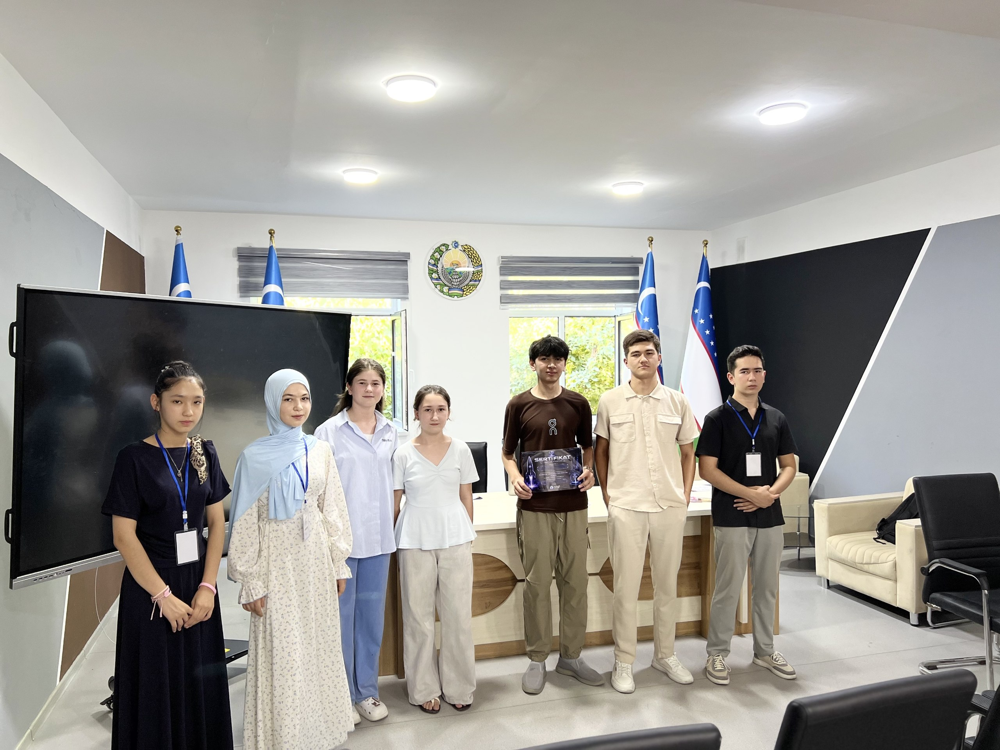
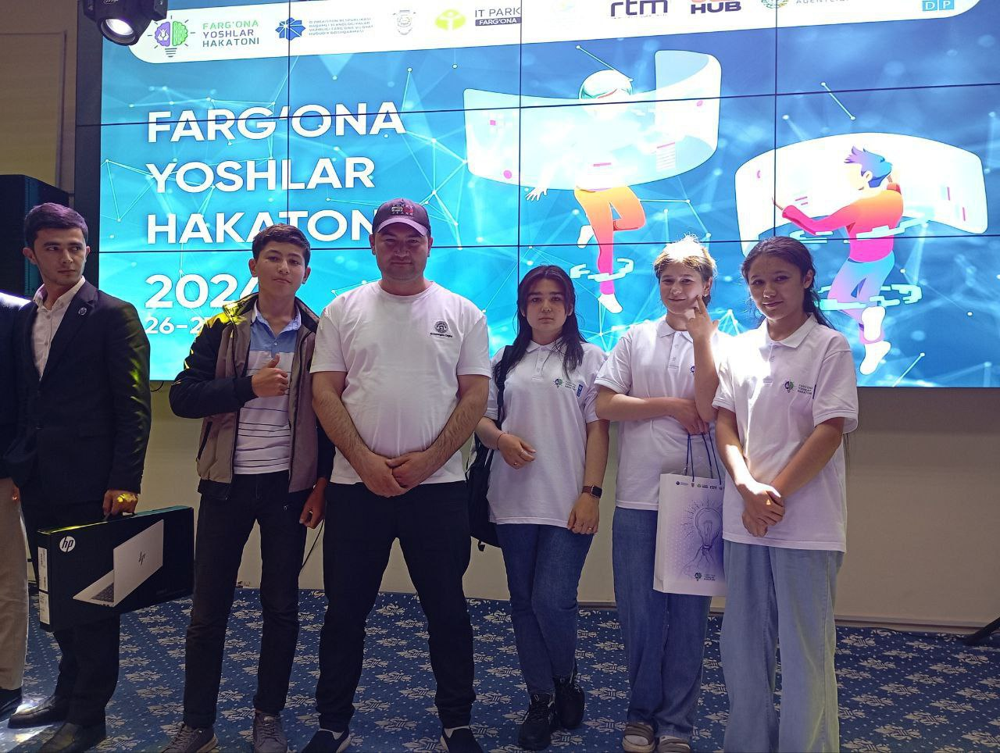

  

  
  
  

---

<h2 align="center">🌟 Profilingizni Haqiqiy Veb-saytga Aylantiramiz!</h2>

  Sizning so'rovingiz bo'yicha, ushbu README sahifasi endi professional shaxsiy veb-sayt ko'rinishida tuzilgan. Quyida o'zingiz haqingizdagi muhim ma'lumotlar zamonaviy UI dizayner va dasturchi uslubida joylashtirilgan.

---

<h2 align="center">Executive Professional Summary</h2>

  

    O'zbekistonlik ambitsiyali <b>Software Developer, Infrastructure & Network Specialist va Visual Designer</b>.  
    <b>4+ yillik tajriba (2020-yildan buyon)</b> — o'quvchilikdan to Hackathon Academy'da amaliyotchi developer/dizaynerlikkacha bo'lgan yo'l.  
    <b>Hackathon IT School 11-sinf o'quvchisi</b>.  
     
    Maqsadim: Dunyo miqyosidagi top universitetda <b>Computer Science & Software Architecture</b> bo'yicha tahsil olish, global miqyosdagi innovatsion ochiq kodli (open-source) loyihalarga hissa qo'shish va yuqori ta'sirga ega raqamli mahsulotlar yaratish.
  

---

<h2 align="center">📸 Media & Visual Gallery (Hackathon Experience)</h2>

<i>Yaqinda bo'lib o'tgan musobaqalardan real lavhalar</i>

<!-- Zamonaviy rasm galereyasi -->

  <table>
    <tr>
      <td></td>
      <td></td>
    </tr>
  </table>

---

<h2 align="center">🏆 Hackathon Projects & Case Studies</h2>

<i>Bosim ostida yaratilgan yechimlar va MVP'lar</i>

<!-- Kartochkalar (Cards) uslubidagi loyihalar ro'yxati -->

  
  

  

---

<h2 align="center">🚀 Technical Stack & Ecosystem Engineering</h2>

  <h3>💻 Software Engineering & Algorithmic Logic</h3>
  

    
    
    
    
  

  <h3>📱 Cross-Platform & Native Mobile Development</h3>
  

    
    
  

  <h3>🌐 Enterprise Networking & Cyber Infrastructure</h3>
  

    
  

  <h3>🎨 Visual Identity & UI/UX Design Engineering</h3>
  

    
    
    
  

---

<h2 align="center">📈 GitHub Analytics & Real-Time Stats</h2>

<!-- Zamonaviy statistika bloklari -->

  <picture>
    <source media="(prefers-color-scheme: dark)" srcset="https://github-readme-stats.vercel.app/api?username=khamdam0va&show_icons=true&theme=tokyonight&hide_border=true&count_private=true&hide=stars">
    <source media="(prefers-color-scheme: light)" srcset="https://github-readme-stats.vercel.app/api?username=khamdam0va&show_icons=true&theme=github_dark&hide_border=true&count_private=true&hide=stars">
    
  </picture>

  <picture>
    <source media="(prefers-color-scheme: dark)" srcset="https://github-readme-streak-stats.herokuapp.com/?user=khamdam0va&theme=tokyonight&hide_border=true">
    <source media="(prefers-color-scheme: light)" srcset="https://github-readme-streak-stats.herokuapp.com/?user=khamdam0va&theme=github_dark&hide_border=true">
    
  </picture>

---

<h2 align="center">📬 Connect & Technical Collaboration</h2>

  
Siz bilan yangi g'oyalar, innovatsion loyihalar va texnik hamkorlikni muhokama qilishdan doimo xursandman!

  
  
  
  
  
    
  <i>Maintained with ❤️ by Sarafroz Khamdamova | Software Engineer & Designer | 2024</i>

